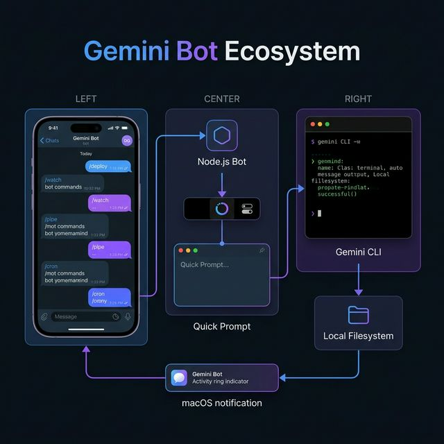
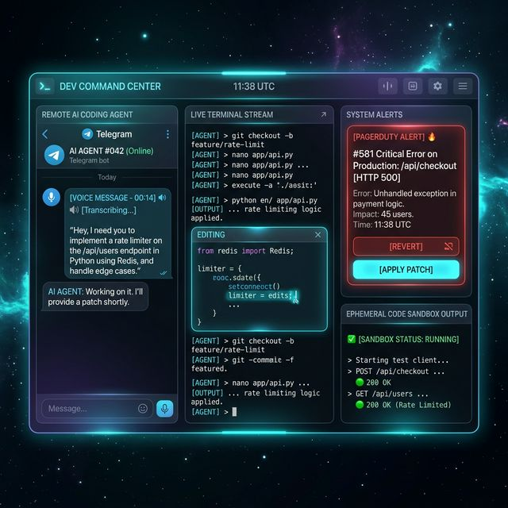
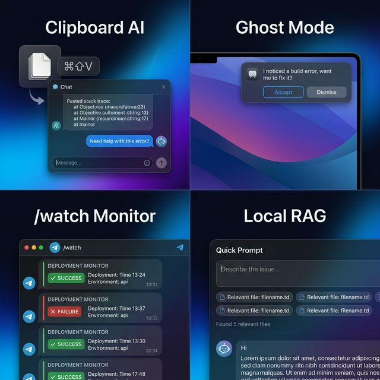
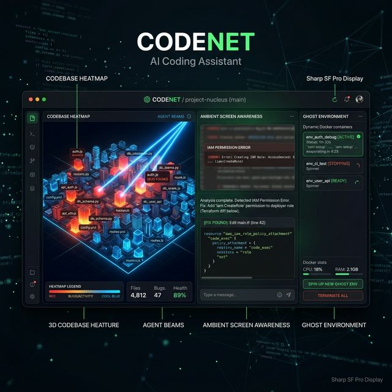
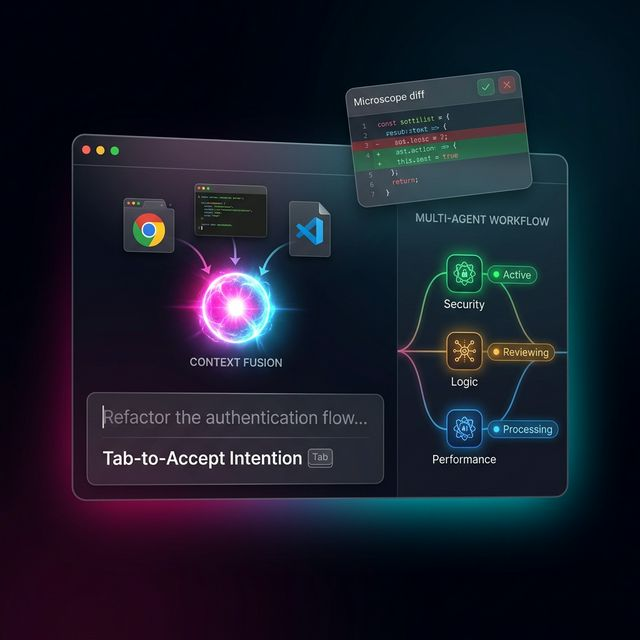
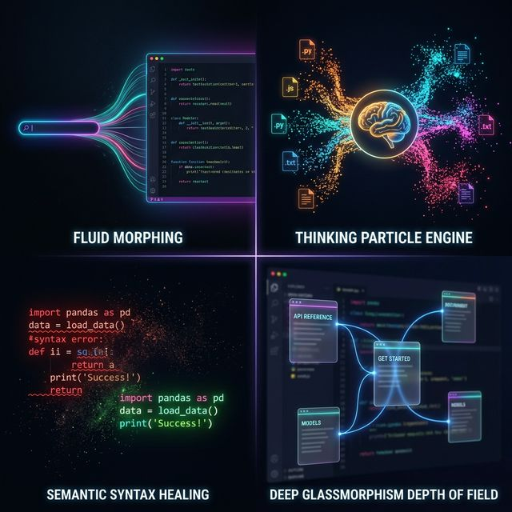

# 🚀 Gemini Bot — Feature Brainstorm

> 50+ ideas across the **Telegram Bot**, **macOS Desktop App**, and **Quick Prompt** — targeting 10× productivity for software & platform engineers.

---

## System Overview



The bot is a three-layer system: **Telegram** as the remote control, the **macOS app** as the desktop companion, and **Gemini CLI** as the execution engine. Every feature idea below lives in one (or more) of these three layers.

---

## Part 1 — Telegram Bot Features



*Concept: The bot as a full "Remote AI Coding Agent" — voice transcription, live terminal streaming, PagerDuty triage with 1-click actions, and ephemeral sandboxes.*

### 🔥 Tier 1: Game-Changers

#### 1. `/deploy` — One-Message Deploy Pipeline
Send `/deploy staging` and the bot runs your deploy pipeline through Gemini CLI, streaming live progress back as edited messages. Auto-detects Kubernetes, Docker Compose, Terraform, shell scripts. Ship from the subway.

```
You: /deploy staging
Bot: ⏳ Running deploy to staging...
     ✅ docker build → done (12s)
     ✅ kubectl apply → 3/3 pods ready
     ✅ smoke test → 200 OK
     🎉 Deploy complete in 38s
```

#### 2. `/watch` — Persistent Monitors with Push Alerts
Background watchers that only alert you when something changes or matches a condition. Like a personal PagerDuty, fired by Gemini.

```bash
/watch "kubectl get pods -n prod | grep CrashLoopBackOff" --every 5m
/watch "git log origin/main..HEAD --oneline" --on-change
```

> 💡 **Implementation**: Persist watchers to `sessions.json`. On each interval, spawn `gemini -p` with the check command. Only notify if the output diverges from baseline.



#### 3. `/diff <PR>` — PR Review from Anywhere
Fetches a GitHub/GitLab PR diff, sends it through Gemini for code review, returns an inline analysis with approve/request-changes inline buttons. Attach a photo of whiteboard notes: "does this design match PR 142?"

#### 4. `/pipe` — Chainable Multi-Step Workflows
Unix pipes, but with AI reasoning between each stage.

```
/pipe "find all TODO comments in src/" | "prioritize by risk" | "open GitHub issues for top 3"
```

Each stage's output becomes the next stage's input. Exit early if any stage produces an empty result.

#### 5. `/oncall` — Instant Incident Triage
Paste/screenshot a stack trace. The bot correlates with:
- Recent commits (`git log --since=2h`)
- Kubernetes pod status
- Recent deploys

Returns: **root cause hypothesis + suggested fix + relevant log lines.** All from your phone at 3am.

#### 6. Voice-to-Architecture / Voice-to-Fix *(New)*
You're commuting and have a sudden realization about a bug. Hold the mic and say:

> *"The database race condition is because we aren't locking the user row during the transaction. Write a script to fix this in `user_service.go` and draft a PR."*

The bot transcribes, executes the plan in your workspace, and replies with the PR link before you arrive. Elevate existing voice support with **intent parsing** — shows a code preview and waits for 👍 before applying.

#### 7. `/cron` — Scheduled Recurring Prompts
Set-and-forget AI-powered scheduled jobs:

```bash
/cron daily 9am "summarize all commits since yesterday, highlight breaking changes"
/cron weekly friday 5pm "write a changelog from this week's merged PRs"
/cron every 30m "check if staging pod count < 3 and alert me"
```

#### 8. `/context` — Sticky System Prompts
A persistent "persona" or context prefix that prepends to every prompt in the session. Think `.cursorrules` but set from Telegram.

```
/context You are reviewing a Go gRPC service.
         Always check: error wrapping, context propagation, proto version skew.
```

#### 9. 🚨 Incident Auto-Investigator *(New — PagerDuty/Datadog Integration)*
When an alert fires, the bot acts as an **L1 responder**. It reads the alert, pulls relevant logs, runs `git blame` on the offending stack trace, and Telegrams you a synthesis:

> *"Service X crashed. Looks like commit `8a9b2c` by [User] 2 hours ago. Want me to revert it or patch the null pointer?"*

Includes inline **[Revert]** / **[Apply Patch]** Telegram buttons for 1-click execution. Zero wake-up-and-laptop required.

#### 10. 📦 Ephemeral Code Sandboxing *(New)*
Send a Python snippet or raw JSON payload directly to the bot. It instantly spins up a temporary execution context and returns the output stream — great for testing small logic blocks while AFK without polluting your local environment.

#### 11. 📺 Live Terminal Streaming Panels *(New)*
Instead of waiting for a long build to finish and getting a text dump, the bot **edits its own Telegram message in real-time**, functioning as a live terminal window right in your chat feed. Shows rolling output, tool call activity, and final result in a single flowing panel.

---

### 🎯 Tier 2: High-Impact Utilities

#### 12. Multi-User Collaboration Mode
Two engineers, one bot session. Both see the same thread. Great for async pair debugging across timezones.

#### 13. `/snapshot` — Shareable Session Report
Exports the current session as a formatted markdown gist or HTML page. "Here's what I debugged at 2am" — shareable URL, no Gemini account required.

#### 14. Contextual Inline Buttons After Every Response
After each answer, show action chips relevant to the response content:
- After code → `[Apply Changes]` `[Run Tests]` `[Show Diff]`
- After an error → `[Search Logs]` `[Check recent deploys]`
- After explanation → `[Go deeper]` `[Show example]`

#### 15. `/metrics` — Personal Productivity Analytics
```
/metrics
📊 This week: 47 prompts across 3 projects
⏱️ Avg response: 8.2s  |  Longest: 4m 12s (terraform apply)
🏆 Most active workspace: gemini-bot (22 prompts)
🔥 Streak: 7 days
```

#### 16. Smart File Auto-Attach
When Gemini creates or edits files, auto-send them back to Telegram as attachments — with syntax-highlighted previews for common file types. Extend with side-by-side diffs.

---

## Part 2 — macOS Desktop App Features



*Concept: The desktop app as an "Omniscient Ambient Assistant" — a 3D project heatmap, screen-aware AI that reads your errors, and ephemeral ghost environments that evaporate on close.*

### 🔥 Tier 1: Game-Changers

#### 17. Floating "Copilot Sidebar" Mode
A persistent panel pinned to the right edge of any app — survives app switches, stays on top. Drag code directly from your editor into it. Think GitHub Copilot Chat as an OS-level overlay.

```
Activation: ⌘⇧\ (configurable)
Modes:      compact (180px wide) | full (320px wide)
Pin to:     left | right | bottom
```

#### 18. Universal Clipboard AI (`⌘⇧V`)
The most frictionless feature you can build. Copy *anything* → press `⌘⇧V` → Quick Prompt opens with it pre-loaded as context.

- **Stack trace** → "What's causing this?"
- **SQL query** → "Optimise this"
- **Hex dump** → "What format is this?"
- **HLS URL** → "How do I play this in FFmpeg?"

Zero typing. Sub-second to context.

#### 19. 🖥️ Ambient Screen Awareness — `Cmd+Shift+Space` *(New)*
You're staring at an AWS IAM error in your browser or a chaotic log in your terminal. Hit `⌘⇧Space`. The app uses macOS screen capture and OCR to instantly **read what you are looking at** and opens a context-aware chat:

> *"I see you're looking at an IAM permission error. I've checked your terraform files, and you're missing `s3:ListBucket` in `analytics_role`. Should I add it?"*

No copy-paste. No typing. The AI understands your current state.

#### 20. 👻 Ghost Local Environments *(New)*
You ask the agent to build a feature in a language or framework you don't have installed. Instead of polluting your system, the app **silently spins up a lightweight Docker/Nix container**, writes the code, exposes the port, and gives you a `localhost:3000` link. When you close the panel, it cleanly evaporates — no cleanup needed.

#### 21. `⌘K` Workspace Command Palette
A fuzzy-search palette listing all projects, sessions, and commands. Like Raycast but wired to your Gemini context.

```
⌘K  →  [ gemini-bot    ● running  3 sessions  ]
        [ bluecentre    ○ idle     1 session   ]
        [ /deploy staging                      ]  ← recent command
        [ /model gemini-2.5-flash              ]
```

#### 22. Animated Menu Bar Activity Ring
Replace the static paperplane icon with a multi-ring indicator:
- **Outer ring**: fills as a prompt streams (progress)
- **Inner dot**: 🟢 idle, 🟡 processing, 🔴 error
- Tap the icon to see a mini activity timeline

#### 23. Rich Desktop Notifications with Inline Actions
When a long-running prompt completes, the notification includes action buttons:

```
📤  Gemini — Response Ready
    "Added exponential backoff to api_client.go..."
    [ Open in Quick Prompt ]  [ Copy ]  [ Apply to Editor ]
```

Uses `UNUserNotificationCenter` on macOS for native interactivity.

#### 24. Editor Bridge — Zero-Copy Context
Detect the frontmost app and auto-extract relevant context:

| App | What it grabs |
|-----|--------------|
| **VSCode** | Active file path + selected text via LSP/AppleScript |
| **Xcode** | Current file + build errors from issue navigator |
| **Terminal / iTerm** | Last command + output |
| **Safari / Chrome** | Page title + selected text |

`⌘⇧G` then says: *"I see you're editing `server.go:142` with build error 'undefined: ctx'. Here's the fix."*

#### 25. Multi-Model Pill Switcher
The active model shows as a tappable pill in the chat header: `gemini-2.5-pro ▾`. Switch mid-conversation. Each model gets a distinct color accent so you visually know which one answered.

```
● gemini-2.5-pro   →  deep blue accent
◆ gemini-2.5-flash →  cyan accent
◈ gemini-exp-1206  →  amber accent
```

#### 26. 🗺️ Codebase "Heatmap" Visualization *(New)*
A beautiful **3D city-like representation** of your project's directory structure. Files glow **hot** (red/orange) if they have recent bugs or high test-failure rates, and **cool** (blue/green) if stable and well-tested. When the agent is actively modifying files, you see beams of light targeting those specific nodes in real-time. Gives you an instant spatial sense of your codebase's health.

#### 27. ⏪ Semantic "Time Travel" Git Manager *(New)*
A visual branch manager that doesn't just show line-by-line diffs, but **explains intent**. It analyzes a branch and says: *"This branch refactors the payment gateway to use Stripe v2 APIs."* When rebasing, it auto-resolves conflicts by understanding codebase logic rather than matching text strings. A true semantic merge tool.

#### 28. Session Branching ("Git for Conversations")
Fork a conversation at any message to explore two different approaches. Visual branch indicator in the header. Collapse/expand branches. Merge the winning thread back to main.

```
main ──●──●──●──[branch A: use Redis]
              └──●──●──[branch B: use in-memory cache] ← winner
```

#### 29. Drag & Drop Anything
Drag files, folders, images, or screen regions directly onto the Quick Prompt panel:
- **Crash log from Console.app** → "Why is this crashing?"
- **Folder from Finder** → "Give me an overview of this project"
- **Screenshot region** → "What does this UI component do?"

---

### 🎯 Tier 2: High-Impact Utilities

#### 30. Semantic Search Across All Sessions (`⌘F`)
Full-text + semantic search over every session ever. "Find where I fixed the auth middleware" returns the right conversation even without exact word match.

#### 31. Pinned Snippets Tray
Star any response to pin it. Collapsed tray at the bottom of Quick Prompt. Your personal AI-generated knowledge base that persists across sessions.

#### 32. Slash Command Templates
Type `/review` in the input and it expands to a structured code review prompt. User-configurable templates stored in `~/.gemini/quick-prompt-templates.json`.

```
/review    →  "Review this code for: correctness, performance, security, style..."
/debug     →  "Error: ___. Expected: ___. Steps to reproduce: ___."
/explain   →  "Explain this to me like I'm..."
```

#### 33. Contribution Heatmap in Menu Bar Dropdown
GitHub-style heatmap of your AI interactions over the past 90 days. Dark green = heavy usage day. Subtle gamification that actually reinforces good habits.

---

## Part 3 — Quick Prompt: Visual & Animation Upgrades



*Concept: The Quick Prompt as the ultra-fast "muscle memory" entry point — drag-and-drop context fusion, ghost-text intention acceptance, micro-view diff previews, and live multi-agent visualization.*

### ⚡ New "Outside-the-Box" Quick Prompt Features

#### 34. 🔀 Drag-and-Drop Context Fusion *(New)*
Drag a terminal window, a Chrome tab URL, and a VS Code file — drop them all into the Quick Prompt at once. It synthesizes all the context into a single glowing **context orb**, then asks:

> *"Okay, I've linked the staging site, the backend error logs, and your local `api.ts`. I see the mismatch. Fix it?"*

Three disparate information sources unified into one prompt with zero manual summarization.

#### 35. ⌨️ Tab-to-Accept Project Intentions *(New)*
Instead of just completing commands, the Quick Prompt **suggests whole intentions** based on your clipboard and current window. If you just copied a JSON payload and open the prompt, it ghost-types:

```
Generate Go structs for this JSON and save to models/
```

Hit `Tab` to accept and execute. Zero manual typing required.

#### 36. 🔍 Micro-View Action Previews *(New)*
Before executing a destructive command or large refactor, the Quick Prompt expands to show a tiny, beautiful **"diff preview" card** inline. It requires a confident swipe or keystroke to confirm — preventing costly errors while moving at lightspeed.

#### 37. 🌿 Multi-Agent Visualization *(New)*
For complex requests, the prompt shows a live **branching agent tree**:

```
Agent 1: Reading docs...        ✅ done
Agent 2: Scanning codebase...   ⏳ in progress
Agent 3: Writing tests...       ⏳ queued
```

See parallel AI processing happen in real-time, visualized as an animated node graph with glowing status indicators.

---

### ✨ Visual & Animation Improvements



*Four animation concepts: (1) Fluid Morphing — the input bar organically expands into a full editor. (2) Thinking Particle Engine — colored file-type particles dissolve into a glowing brain. (3) Semantic Syntax Healing — broken red code turns to dust, replaced by glowing green. (4) Deep Glassmorphism — floating doc cards connected by animated bezier curves above a blurred editor.*

#### 38. Glassmorphism 2.0 — Dynamic Tinting
The current `.popover` material is solid. Elevate it:
- Sample the dominant color from the background using `CGWindowListCopyWindowInfo`
- Tint the frosted glass with a subtle hue from whatever app is behind it
- Color shifts slowly as you drag the panel

> The panel "absorbs" the aesthetic of whatever it floats over.

#### 39. Animated Gradient Border During Streaming
While a response is generating, a thin gradient border orbits the panel frame:

```
Colors: blue → purple → cyan → blue (120° offset between each token)
Speed: ~3s per full rotation, decelerating as generation slows
End state: border fades out over 400ms when done
```

Implemented as a `CAGradientLayer` + `CABasicAnimation` on `strokeStart`/`strokeEnd` of a `CAShapeLayer` mask.

#### 40. 🌊 Fluid Spatial Metamorphosis — Morphing UI *(New)*
When you type a command in the Quick Prompt and the response needs a full-screen code editor, the window doesn't just "pop" open. The small input bar **seamlessly morphs and expands** into the editor window, with code organically unfolding line-by-line out of the text you typed. Content-aware window expansion with spring physics — feels like the UI is *alive*.

#### 41. 🧠 Thinking Particle Engine *(New)*
When the AI is gathering context, replace the boring spinner with a **flocking particle system**. If it's reading 10 Python files, 10 tiny Python-colored particle clusters orbit the input bar and dissolve into the brain icon as each file is ingested. Gives a visceral, physical feeling to data processing.

#### 42. 💚 Semantic Syntax Healing *(New)*
When the agent applies a fix to broken code, the text doesn't just blink and change. The red error text visually **dissolves into dust** particles that drift away, and the correct green code **materializes** in a glowing "healing" animation. Massive dopamine hit for fixing broken builds.

#### 43. Message Entrance Choreography
Messages enter with personality:

| Message type | Animation |
|-------------|-----------|
| User bubble | Slide in from right + scale 0.95→1.0 |
| Assistant text | Fade in line-by-line, 40ms stagger per line |
| Code block | Vertical unfold ("paper unrolling"), 180ms |
| Tool activity | Slide up from bottom with opacity fade |

#### 44. Breathing Sparkle Avatar
The ✨ sparkles icon during generation:
- **Idle**: slow 2s pulse (opacity 0.6→1.0→0.6)
- **Generating**: `CAEmitterLayer` with tiny star particles floating upward, 0.3 opacity
- **Done**: single bright flash then settle

#### 45. Syntax-Highlighted Code Blocks
Full per-language coloring using a lightweight tokenizer. Match the user's active Xcode/VSCode theme by reading their preferences file. Support the key languages: Swift, Python, TypeScript, Go, Rust, SQL, Bash.

Current state: `.monospaced` font on dark background.
Upgraded: token-colored like a real editor, diff-aware (green/red line highlights for diffs).

#### 46. Content-Aware Panel Resizing
Panel height is currently fixed after expansion. Make it content-aware:
- Grows downward as messages accumulate (spring physics, existing infrastructure)
- Caps at `screen.height * 0.85`
- Gracefully crunches scroll content when near screen bottom
- Bottom edge springs visibly when new content pushes it

#### 47. Thinking State: Orbital Dots
Replace `ProgressView()` with three dots orbiting an ellipse path (à la Apple's Siri thinking ring):

```
   · ← fast-moving foreground dot (100% opacity)  
 ·   · ← trailing dots (60%, 30% opacity)
```
Implemented as a `Canvas` with `TimelineView(.animation)` drawing dots at `sin/cos` offsets.

#### 48. 🎵 Tactile Audio & Haptics *(New)*
Software should feel satisfying to the senses. Add **subtle trackpad haptic bumps** and hyper-minimal UI sounds:
- A soft, deep **"thump"** when a heavy process starts
- A whisper-quiet **"click-clack" rhythm** mimicking a fast typist when the model is streaming code
- A bright, resonant glass **"chime"** when a test suite passes

Communicates progress through touch and sound without being intrusive.

#### 49. Dynamic Appearance Cross-Fade
When macOS flips Dark↔Light mode, the panel doesn't jarring-swap — it cross-fades with a 200ms luminance wipe. Feels intentional.

#### 50. Typewriter Cursor on Streaming Text
While text is streaming token-by-token (once hooks land), show a blinking `▋` cursor at the insertion point. Disappears smoothly when generation stops.

#### 51. Response "Weight" Indicator
A subtle glow intensity next to each response proportional to its complexity:
- Quick one-liner → soft dim glow
- Code generation → moderate glow
- Multi-step agentic work → pulsing bright glow

Communicates "this response took real effort" without being noisy.

---

## Part 4 — Outside-the-Box Ideas

#### 52. 👻 Ghost Mode — Background Pair Programmer
The app silently watches your terminal output (opt-in via a named pipe / stdin capture). On detecting a build error or test failure, a non-intrusive nudge appears:

```
┌─────────────────────────────────────────────────┐
│ 👻 Gemini noticed: TypeError in test run        │
│    "Cannot read property 'id' of undefined"     │
│              [ Investigate ]  [ Dismiss ]        │
└─────────────────────────────────────────────────┘
```

No prompt needed. Senior engineer over your shoulder.

#### 53. ⏮️ Session Replay — Time-Travel Your Work
Scrub through any past session like a video. See the conversation unfold chronologically, alongside which files were changed and what commands ran. Export as an MP4 walkthrough for docs, onboarding, or demos.

#### 54. 🔀 Cross-Device Handoff — Telegram ↔ Desktop
Start a session on Telegram from your phone. When you open the macOS app, it detects the active session and offers to continue it in Quick Prompt with full history intact. Seamless handoff via the shared `~/.gemini/tmp/{project}/chats/` session store.

```
macOS notification: "Continue your session from Telegram? (auth middleware refactor)"
                    [ Resume in Quick Prompt ]
```

#### 55. 📸 "Explain This Screen" — Screenshot AI (`⌘⇧X`)
Global hotkey captures a selected screen region and opens Quick Prompt with it as context:

```
⌘⇧X → crosshair selector → screenshot → Quick Prompt opens:
"I've captured this screen. What do you see / how do I..."
```

Works on: unfamiliar admin panels, complex error dialogs, database visualizations, architecture diagrams.

#### 56. 🗣️ Natural Language Reminders
> "Remind me to check the staging deploy every day at 3pm"

Bot creates a persistent reminder (stored in `sessions.json`) that fires via Telegram message and/or macOS notification at the scheduled time, with your project context pre-loaded.

#### 57. 🖥️ Ambient Status Widget
Always-on-top mini widget (like the macOS music mini-player) showing live state:
- Current git branch + last commit (`git log -1 --oneline`)
- CI status badge (green/red dot)  
- Active session name
- Token usage today

Click any element to open relevant Quick Prompt context pre-filled.

#### 58. 🧠 Local RAG over Your Codebase
Index your project into an on-device vector store (private, no network calls). Quick Prompt queries first run a semantic search over your codebase, then inject the top-5 most relevant snippets as context before calling Gemini CLI.

```
You:    "How does our auth flow work?"
System: [Searching codebase... found 5 files]
        [middleware/auth.go, handlers/login.go, pkg/jwt/claims.go...]
Gemini: "Your auth flow starts in middleware/auth.go:42 where..."
```

No need to specify file paths. The AI finds the right code.

#### 59. 💡 Smart Follow-Up Suggestions
After each response, show 2–3 contextual chips predicting your next question:

```
[ Run the tests ]   [ Show the full diff ]   [ Explain the error handling ]
```

Generated by a cheap fast-model call on the response content. Reduces "what do I say next" friction to a single tap.

---

## Priority Matrix

| Impact ↕ / Effort → | Low Effort | Medium Effort | High Effort |
|----------------------|------------|---------------|-------------|
| **Huge impact**      | #8 `/context`, #14 Inline buttons, #25 Model switcher, #59 Suggestions | #18 Clipboard AI, #23 Desktop notifications, #47 Orbital dots, #35 Tab-to-Intent | #17 Copilot sidebar, #24 Editor Bridge, #52 Ghost Mode, #58 Local RAG, #19 Ambient Screen |
| **High impact**      | #32 Templates, #44 Breathing avatar, #50 Typewriter cursor | #39 Gradient border, #54 Handoff, #55 Screenshot AI, #40 Fluid Morph, #42 Syntax Healing | #28 Session branching, #53 Replay, #26 Heatmap Viz, #37 Multi-Agent Viz |
| **Nice to have**     | #33 Heatmap, #47 Ripple feedback | #57 Ambient widget, #48 Audio/Haptics | #12 Multi-user, #56 NL reminders, #20 Ghost Env |

---

## Quick Wins to Build Next

These can be shipped in a single focused session each:

1. **`⌘⇧V` Clipboard AI** — read `NSPasteboard` on hotkey, pre-fill Quick Prompt
2. **Orbital thinking dots** — replace `ProgressView()` with Canvas animation
3. **Streaming gradient border** — `CAShapeLayer` + `CABasicAnimation` on the panel
4. **`/context` command** — prepend sticky prompt to every `executePrompt` call
5. **Inline action buttons** — parse response type, append `Markup.inlineKeyboard` conditionally
6. **Syntax highlighting** — integrate `Highlightr` or hand-roll a simple tokenizer for top 6 languages
7. **Tab-to-Accept Intentions** — detect clipboard type on prompt open, ghost-text the suggested action
8. **Incident Auto-Triage** — webhook receiver for PagerDuty/Datadog alerts → auto-investigate → Telegram
9. **Semantic Syntax Healing animation** — `CAEmitterLayer` dissolve on code block replacement
10. **Live terminal streaming** — bot edits its own message in real-time using Telegram `editMessageText` + SSE from CLI
