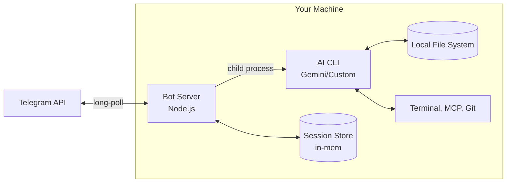
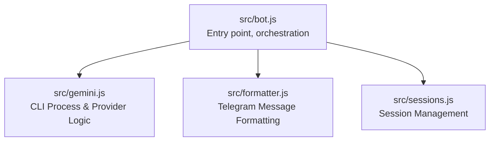
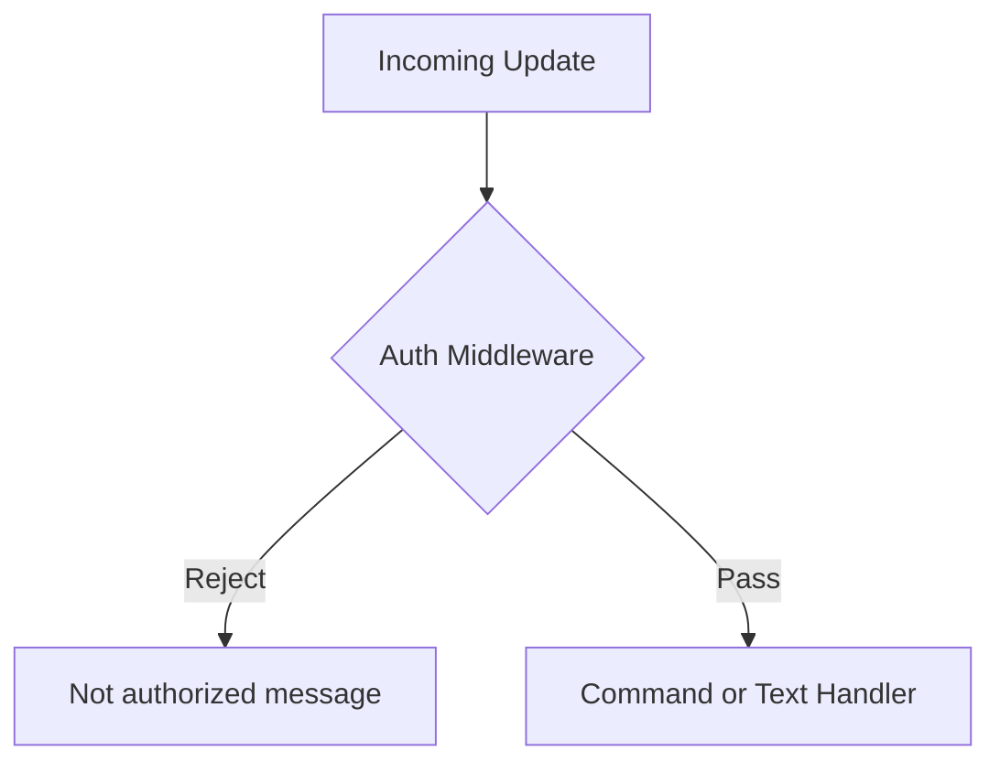
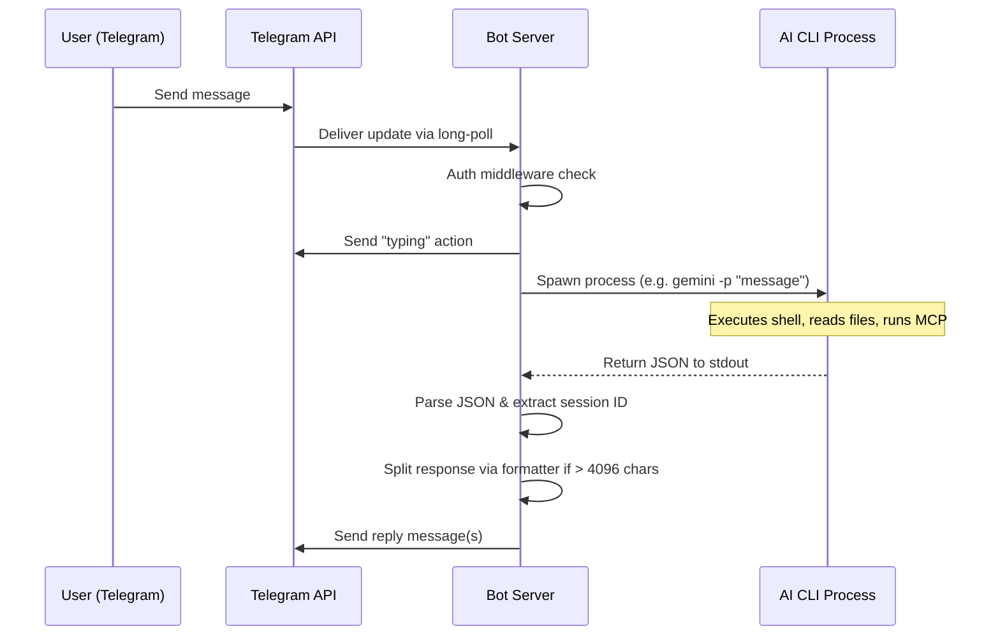
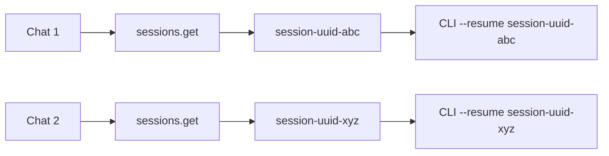
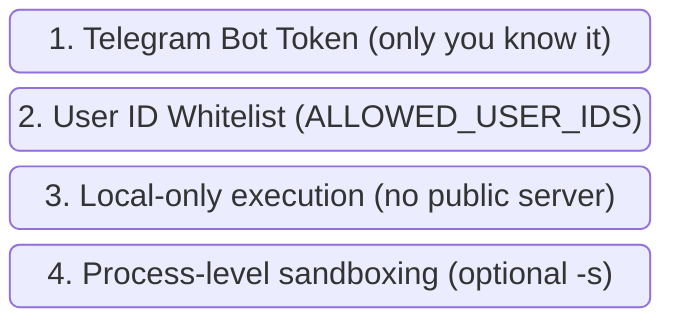

# NexusAgent

A macOS menu bar app and Telegram bot that bridges your messages to locally-installed AI coding CLI tools, giving you remote access to full coding agent capabilities (file editing, terminal commands, MCP tools, multi-provider support) from any device with Telegram or directly from your Mac's Quick Prompt.

---

## System Architecture

### Overview

The bot acts as a thin bridge between the Telegram Bot API and a locally-running AI CLI process. Every message you send on Telegram is forwarded as a headless prompt to your configured CLI tool (e.g. `gemini -p`, or a custom provider), and the CLI's JSON response is parsed, formatted, and sent back as a Telegram reply.



### Key Design Decisions

| Decision | Rationale |
|----------|-----------|
| **Long polling** (not webhooks) | No public URL or TLS certificate required — runs entirely on your local machine |
| **Child process per prompt** | The CLI is stateless per invocation; session continuity is handled via CLI flags (`--resume`) |
| **In-memory session store** | Simple `Map<chatId, sessionId>` — no database needed for single-user use |
| **JSON output format** | Structured parsing of CLI responses instead of fragile text scraping |
| **`yolo` approval mode** | Auto-approves all tool actions for unattended operation (configurable) |

---

## Software Architecture

### Module Dependency Graph



### Module Details

#### `src/bot.js` — Bot Server & Orchestration

The main entry point. Initializes the Telegraf bot, registers middleware, commands, and message handlers.

**Responsibilities:**
- Load configuration from environment variables via `dotenv`
- Initialize Telegraf with the bot token
- Apply authentication middleware (user ID whitelist)
- Register command handlers (`/start`, `/new`, `/session`, `/help`)
- Forward incoming text messages to the Gemini module
- Format and send responses back, splitting if needed
- Maintain typing indicator during long-running prompts
- Graceful shutdown on `SIGINT`/`SIGTERM`

**Middleware pipeline:**



#### `src/gemini.js` — AI CLI Interface & Pluggable Provider Management

Manages spawning of AI CLI child processes and tracking sessions per chat.

**Responsibilities:**
- Spawn `gemini -p "<prompt>"` or custom provider using `CLI_COMMAND_TEMPLATE`
- Tokenize and inject `{prompt}` and `{model}` into custom provider arguments
- Set working directory to `GEMINI_WORKING_DIR`
- If a session exists for the chat, pass it to context continuity (e.g., via `--resume`)
- Collect stdout/stderr buffers and parse on process exit
- Stream support (`executePromptStreaming`) and multi-strategy JSON parsing
- Track active running processes to allow prompt cancellation

**Exported API:**

| Function | Description |
|----------|-------------|
| `executePrompt(prompt, options)` | Run a prompt and wait, return `{ text, sessionId }` |
| `executePromptStreaming(prompt, options)` | Run prompt with callback chunks |
| `cancelPrompt(chatId)` | Terminate a running process for a chat |
| `clearSession(chatId)` | Forget session for a chat |

**CLI invocation example:**
```bash
gemini -p "explain this function" \
  --output-format json \
  --approval-mode yolo \
  --resume 910c55f0-f6a2-450e-9129-215a4e07abe2
```

#### `src/formatter.js` — Response Formatting

Handles Telegram's message constraints and format conversion.

**Responsibilities:**
- Split responses exceeding Telegram's 4096-character limit into multiple messages
- Intelligent splitting at paragraph boundaries → newlines → spaces → hard break
- MarkdownV2 escaping utility (for future use)
- Format selection (currently sends as plain text for maximum compatibility)

---

## Request Lifecycle

A full request-response cycle for a text message:



---

## Session Management

Sessions provide conversation continuity so follow-up messages have context.



- **First message** in a chat: no resume flag is passed. The CLI starts a new session and returns a `sessionId` in its JSON output.
- **Subsequent messages**: the stored `sessionId` is passed (via `--resume`), giving the CLI full conversation history.
- **`/new` command**: deletes the stored session ID, so the next message starts fresh.
- **Storage**: persisted across restarts using `.bot-sessions.json`.

---

## Security Model



| Layer | Protection |
|-------|------------|
| **Bot token** | Only someone with the token can receive updates. Keep it secret. |
| **User ID whitelist** | Even if someone finds your bot, they can't interact unless their Telegram user ID is in `ALLOWED_USER_IDS`. Unauthorized attempts are logged. |
| **Local execution** | The bot uses long-polling, not webhooks — no ports are exposed to the internet. |
| **Sandbox mode** | Pass `GEMINI_APPROVAL_MODE=default` or use Gemini CLI's `--sandbox` flag for restricted execution in a Docker/Podman container. |

> ⚠️ **Warning**: `GEMINI_APPROVAL_MODE=yolo` auto-approves all tool actions (file writes, command execution). Only use this when you trust all messages will come from you.

---

## Quick Start

### 1. Create a Telegram Bot

1. Message [@BotFather](https://t.me/BotFather) on Telegram
2. Send `/newbot` and follow the prompts
3. Copy the bot token

### 2. Get Your Telegram User ID

Message [@userinfobot](https://t.me/userinfobot) on Telegram — it will reply with your user ID.

### 3. Configure

```bash
cp .env.example .env
```

Edit `.env`:
```
TELEGRAM_BOT_TOKEN=your_bot_token_here
ALLOWED_USER_IDS=your_user_id_here
GEMINI_WORKING_DIR=/path/to/your/project
```

### 4. Install Dependencies

```bash
npm install
```

### 5. Run

There are four ways to run the bot:

#### Option A: Direct (foreground)

```bash
npm start
```

Runs in the foreground — you'll see logs in your terminal. Press `Ctrl+C` to stop.

#### Option B: Daemon via `bot.sh`

```bash
./bot.sh start     # Start in background
./bot.sh stop      # Graceful shutdown
./bot.sh restart   # Stop + start
./bot.sh status    # Check if running
./bot.sh logs      # Tail the log file
```

Runs in the background with PID tracking and orphan process cleanup. Logs are written to `bot.log`.

#### Option C: macOS Menu Bar App

Download the latest DMG from the [Releases page](https://github.com/VitruvianSoftware/nexus-agent/releases). Open it and drag the app to your Applications folder.

A native SwiftUI app that lives in the menu bar (no dock icon). Provides a GUI to start/stop the bot, view logs, configure settings, and handle Quick Prompts. See [macOS App Setup](#macos-menu-bar-app) below for Gatekeeper instructions.

#### Option D: Gemini CLI Extension

```bash
gemini extensions install https://github.com/<your-repo>/nexus-agent
# or link locally:
gemini extensions link /path/to/nexus-agent
```

Installs the bot as a Gemini CLI extension. Ask Gemini *"help me set up the Telegram bot"* and it will walk you through configuration using the bundled playbook.

---

## macOS Menu Bar App

A native SwiftUI companion app that manages the bot daemon from the menu bar.

### Features

| Feature | Description |
|---------|-------------|
| **Status icon** | ✈️ filled = running, outline = stopped |
| **Controls** | Start / Stop / Restart from the dropdown |
| **Logs** | Recent log lines inline + open full log |
| **Settings** | GUI for bot token, user IDs, working dir, model, approval mode |
| **Auto-start** | Optionally start the bot when the app launches |
| **No dock icon** | `LSUIElement=true` — menu bar only |

### Installation

The application is distributed as a universal DMG. Because it is currently **unsigned**, macOS Gatekeeper will block the first launch. Follow these steps to install and open it:

1. **Download** the latest `NexusAgent-x.x.x-universal.dmg` from the [GitHub Releases page](https://github.com/VitruvianSoftware/nexus-agent/releases).
2. **Mount the DMG** by double-clicking it.
3. **Install** by dragging the `NexusAgent` app into the `Applications` folder shortcut.
4. **First Launch (Important):**
   - Open your `Applications` folder in Finder.
   - You **cannot** double-click the app directly (macOS will warn you about an unidentified developer).
   - *For macOS 14 Sonoma and older:* **Right-click (or Control-click)** the app and select **Open**.
   - *For macOS 15 Sequoia and newer:* Apple has removed the Right-click bypass. You have two options:
     - **Option A (System Settings):** Double click the app and click **Done** on the warning. Open **System Settings > Privacy & Security**, scroll down to the Security section, and click **Open Anyway**.
     - **Option B (Terminal):** Open your **Terminal** and run the following command to clear the browser download quarantine flag, then open the app normally:
       ```bash
       find /Applications/NexusAgent.app -print0 | xargs -0 xattr -c
       ```

*You only need to do this exact process once. For subsequent launches, or when the app auto-updates, it will open normally.*

### Auto-Update

The app includes a built-in auto-updater. It will periodically check the GitHub Releases page for new versions. When an update is available:
1. An "Update available" banner will appear in the menu bar dropdown.
2. Click the **Update** button.
3. The app will download the new version, replace itself in the `Applications` folder, and automatically relaunch.

---

## Bot Commands

### Core

| Command | Description |
|---------|-------------|
| `/start` | Welcome message and info |
| `/help` | Show all available commands |

### Session Management

| Command | Description |
|---------|-------------|
| `/new` | Clear session and start fresh |
| `/session` | Show current session info |
| `/sessions` | List all available Gemini CLI sessions |
| `/resume <n>` | Resume a session by index (e.g. `/resume 5` or `/resume latest`) |
| `/delete_session <n>` | Delete a session by index |

### CLI Management

| Command | Description |
|---------|-------------|
| `/extensions` | List installed Gemini CLI extensions |
| `/skills` | List available agent skills |
| `/mcp` | List configured MCP servers |

### Settings (per-chat)

| Command | Description |
|---------|-------------|
| `/model <name>` | Set the Gemini model (e.g. `/model gemini-2.5-flash`) |
| `/mode <mode>` | Set approval mode (`default`, `auto_edit`, `yolo`) |
| `/sandbox` | Toggle sandbox mode (Docker/Podman) |
| `/workdir <path>` | Set working directory for Gemini CLI |
| `/settings` | Show all current settings |


## Configuration Reference

| Variable | Description | Default |
|----------|-------------|---------|
| `TELEGRAM_BOT_TOKEN` | Bot token from BotFather | *required* |
| `ALLOWED_USER_IDS` | Comma-separated Telegram user IDs | *empty = all allowed* |
| `GEMINI_WORKING_DIR` | Working directory for AI CLI | Current directory |
| `GEMINI_TIMEOUT_MS` | Max execution time per prompt (ms) | `300000` (5 min) |
| `GEMINI_APPROVAL_MODE` | Tool approval mode (`default`, `auto_edit`, `yolo`) | `yolo` |
| `GEMINI_MODEL` | Default model to use | CLI default |
| `GEMINI_BIN` | Path to the `gemini` binary | `/opt/homebrew/bin/gemini` |
| `CLI_PROVIDER` | Provider selection (`gemini`, `custom`) | `gemini` |
| `CLI_COMMAND_TEMPLATE` | Custom CLI template (e.g. `ollama run {model} "{prompt}"`) | *empty* |
| `GEMINI_THINKING` | Employs extended timeouts to support thinking models | *false* |

## Requirements

- Node.js 18+
- [Gemini CLI](https://github.com/google-gemini/gemini-cli) installed and authenticated (`npm i -g @google/gemini-cli`)
- A Telegram bot token from [@BotFather](https://t.me/BotFather)
